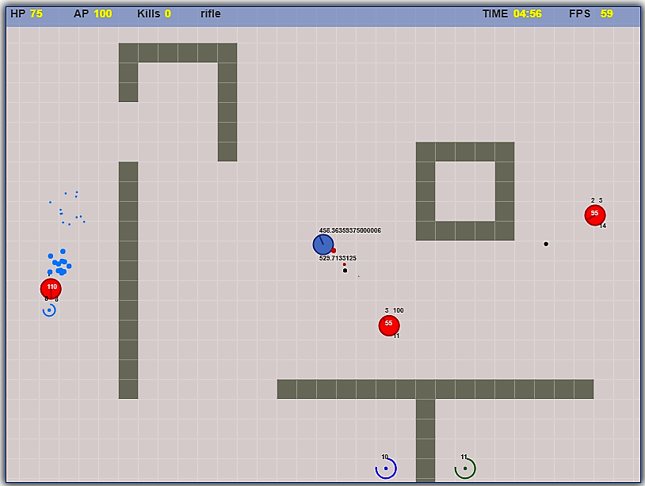

# Corbe Arena shooter 2D!

Esempio di shooter 2D realizzato per studiare il canvas e lo sviluppo di giochi con tecnologie web. Il gioco ricrea le meccaniche di arena shooter quali Quake 3 Arena, Unreal tournament, etc.

## Features
- [x] map built with tiles 
- [x] different types of tiles (lava, toxic water)
- [x] camera following different entities (player, bots) 
- [x] collision system for all entities
- [x] particles (debris, blood, explosion)
- [x] powerups system with different respawn time + counter
- [ ] different weapons
- [ ] different game modes (deathmatch, team deathmach, capture the flag, skirmish)
- [x] bots AI
- [ ] multiple maps
- [ ] music and effects
- [ ] multiplayer
- [ ] movimenti in funzione del tempo: [source](https://www.viget.com/articles/time-based-animation/)

### Installation
Installare tramite:

    npm install

### Development

Lanciare il server di sviluppo con:

    npm start
    

Compile TypeScript app and copy index.html to the `dist` folder.

    npm run build

## Built With

HTML5, CSS, Typescript, canvas, parcel

## Versioning

Versione 0.0.1

## License

This project is licensed under the MIT License - see the [LICENSE.md](LICENSE.md) file for details

## Contributing

Pull requests and stars are always welcome.

For bugs and feature requests, [please create an issue](https://github.com/LorenzoCorbella74/testCanvasGame/issues).

1. Fork it!
2. Create your feature branch: `git checkout -b my-new-feature`
3. Commit your changes: `git commit -am 'Add some feature'`
4. Push to the branch: `git push origin my-new-feature`
5. Submit a pull request :D

## Author

- [github/LorenzoCorbella74](https://github.com/LorenzoCorbella74)
